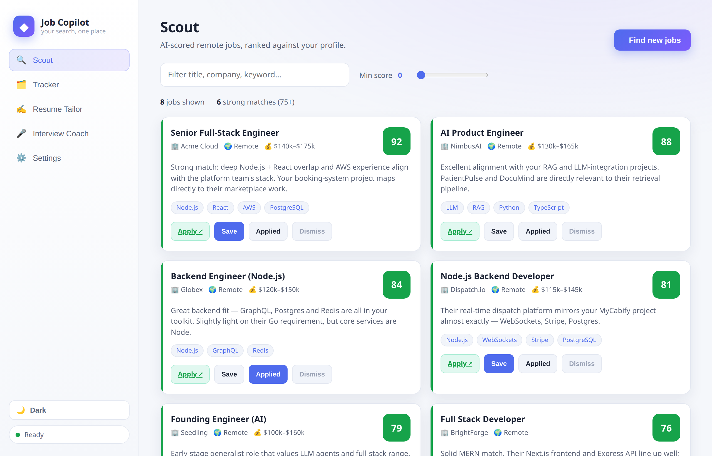
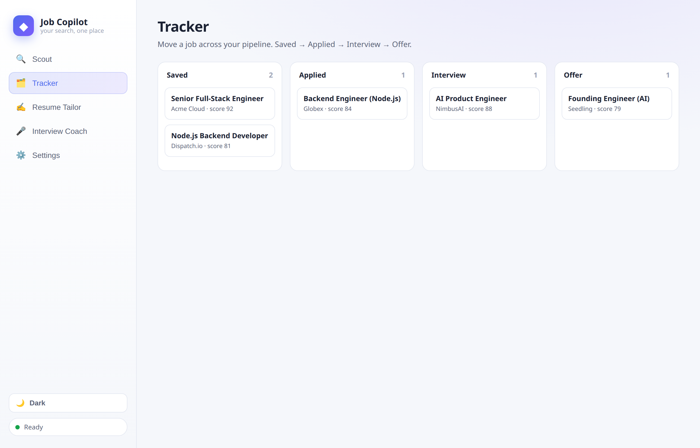
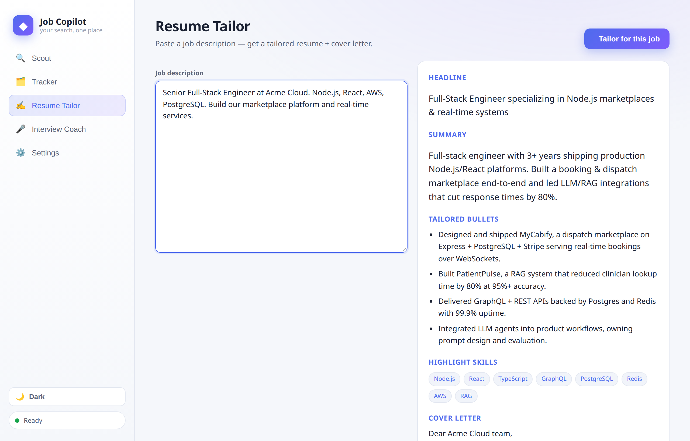
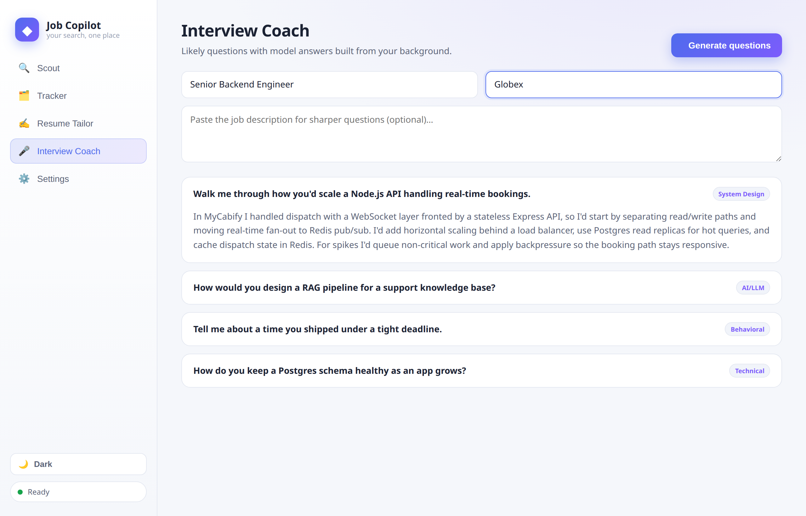
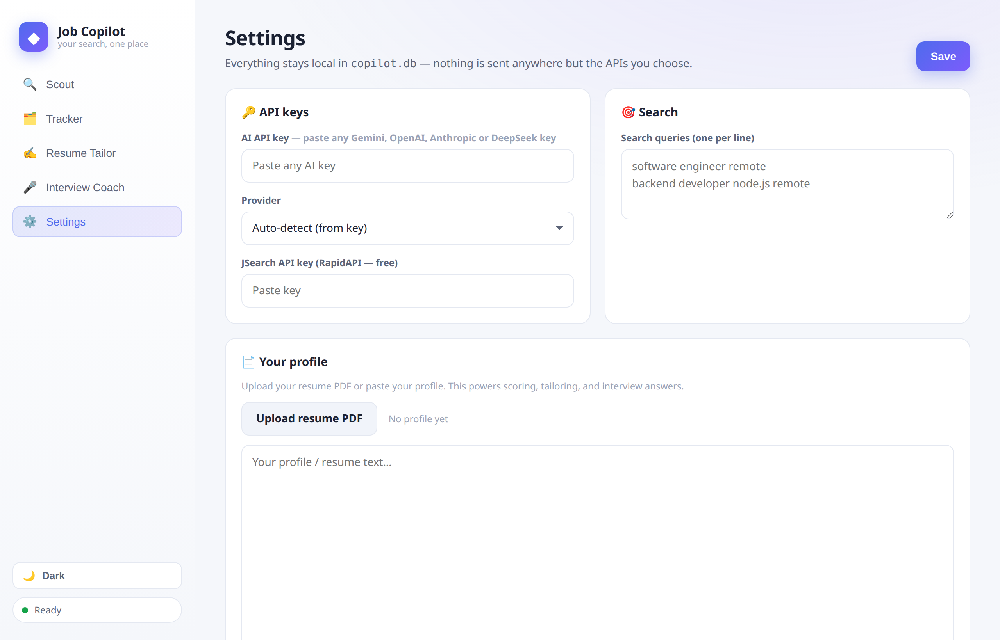
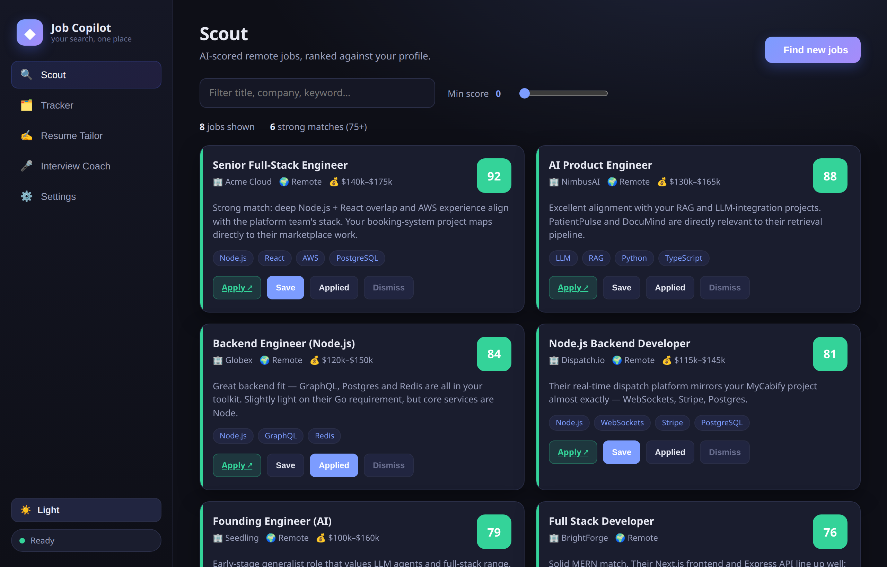

# ◆ Job Copilot

**Your entire job search in one clean, local app.** Find AI-scored remote jobs, track your pipeline, tailor your resume, and prep for interviews — all powered by your own resume, all stored locally on your machine.

> One problem, solved: a job search is normally scattered across email digests, spreadsheets, resume drafts, and interview notes. Job Copilot pulls **finding, applying, and prepping** into a single workspace.


---

## ✨ What it does

| Tool | What it solves |
|------|----------------|
| 🔍 **Scout** | Pulls fresh remote jobs and scores each 0–100 against *your* profile with reasons + matching skills. |
| 🗂️ **Tracker** | Drag jobs across a Kanban pipeline: **Saved → Applied → Interview → Offer**. |
| ✍️ **Resume Tailor** | Paste any job description → get a tailored headline, summary, bullets, skills, and a cover letter. |
| 🎤 **Interview Coach** | Generate likely interview questions *with model answers built from your real projects*. |
| ⚙️ **Settings** | Your resume/profile + API keys, saved locally. Nothing leaves your machine except the APIs you choose. |

**Plus:** clean **light / dark themes** (toggle in the sidebar, remembered across sessions) and **bring-any-AI-key** — paste a Gemini, OpenAI, Anthropic, or DeepSeek key and the provider is auto-detected. No model to configure.

---

## 📸 Screenshots

### Scout — AI-scored jobs ranked against your profile


### Tracker — drag jobs through your pipeline


### Resume Tailor — tailored resume + cover letter for any posting


### Interview Coach — questions with model answers from your background


### Settings — everything local, bring any AI key


### Dark mode — one click in the sidebar


---

## 🎬 Demo

A ~15-second walkthrough lives at [`docs/demo.gif`](docs/demo.gif) (above) and as MP4 at [`docs/demo.mp4`](docs/demo.mp4).

---

## 🧱 Architecture

Rebuilt to be **local-first with zero external infrastructure** — no cron, no email service, no cloud database.

```
┌──────────────────────────────────────────────┐
│  Browser SPA  (web/ — vanilla HTML/CSS/JS)    │
└───────────────┬──────────────────────────────┘
                │  JSON API
┌───────────────▼──────────────────────────────┐
│  app.py       (FastAPI)                       │
│  ├── copilot/store.py   SQLite (copilot.db)   │
│  ├── copilot/ai.py      Gemini: score/tailor/ │
│  │                      interview             │
│  └── copilot/jobs.py    JSearch fetch + PDF   │
└───────────────┬───────────────┬──────────────┘
        JSearch API        Gemini API
```

- **Backend:** one FastAPI app (`app.py`)
- **Storage:** a single local SQLite file (`copilot.db`) — jobs, tracker state, profile, and keys
- **AI:** multi-provider, isolated in `copilot/ai.py` — paste any **Gemini / OpenAI / Anthropic / DeepSeek** key and the provider is auto-detected from the key prefix
- **Jobs:** RapidAPI JSearch
- **Frontend:** dependency-free SPA — no build step, with light/dark theming

### Removed from the old design
The previous version relied on GitHub Actions cron, Supabase, and Resend email. All of that is gone — Job Copilot is a single app you open in your browser.

---

## 🚀 Quick start

```bash
# 1. Install deps
python3 -m venv .venv
.venv/bin/pip install -r requirements.txt

# 2. Run
.venv/bin/uvicorn app:app --reload --port 8787

# 3. Open
#    http://localhost:8787
```

Then in **Settings**:
1. Paste **any AI key** — Gemini ([Google AI Studio](https://aistudio.google.com), free), OpenAI, Anthropic, or DeepSeek. The provider is auto-detected. Add your **JSearch** key ([RapidAPI](https://rapidapi.com/letscrape-6bRBa3QguO5/api/jsearch), free).
2. Upload your **resume PDF** (or paste your profile).
3. Set your **search queries** (one per line).
4. Hit **Save**, go to **Scout**, and click **Find new jobs**.

---

## 🔑 Configuration

Everything is entered through the **Settings** screen and stored in `copilot.db` (gitignored). No `.env` files required.

| Setting | Purpose |
|---------|---------|
| `AI_API_KEY` | Any Gemini / OpenAI / Anthropic / DeepSeek key — powers scoring, tailoring, interview prep |
| `AI_PROVIDER` | Optional — leave on **Auto-detect**, or force a provider (e.g. to pick DeepSeek over OpenAI, since both use `sk-` keys) |
| `JSEARCH_API_KEY` | RapidAPI JSearch — job sourcing |
| Search queries | One query per line (e.g. `backend developer node.js remote`) |
| Profile / resume | Powers all three AI tools |

**Provider auto-detection:** `AIza…` → Gemini · `sk-ant-…` → Anthropic · `sk-…` → OpenAI (or DeepSeek via the provider selector). Sensible default model per provider — no model field to fill in.

---

## 🆓 Free tier

| Service | Free allowance |
|---------|----------------|
| Google Gemini 2.5 Flash | ~1,000 requests/day |
| JSearch (RapidAPI) | 200 requests/month |
| SQLite / FastAPI | free & local |

**Cost: $0/month.**

---

## 📁 Structure

```
job_scout_agent/
├── app.py                 ← FastAPI app + JSON API
├── copilot/
│   ├── store.py           ← SQLite (jobs, tracker, settings)
│   ├── ai.py              ← multi-provider AI: score / tailor / interview
│   └── jobs.py            ← JSearch fetch + resume PDF parse
├── web/
│   ├── index.html         ← SPA shell
│   └── assets/            ← style.css, app.js, favicon.svg
├── docs/                  ← screenshots + demo media
└── requirements.txt
```

---

## 🔧 Notes

- **Add / swap an AI provider** by editing `copilot/ai.py` only — every model call and the auto-detection live there.
- **Toggle light / dark** from the sidebar; your choice is remembered in the browser.
- **Resume PDFs** must be text-based; scanned PDFs return no text.
- **Your data stays local** — `copilot.db` is gitignored and never uploaded.
